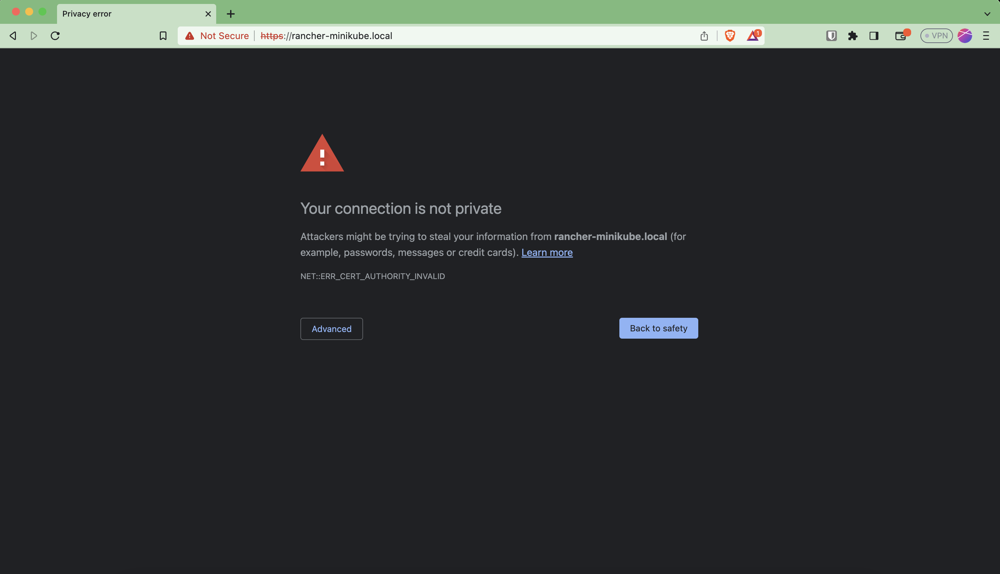
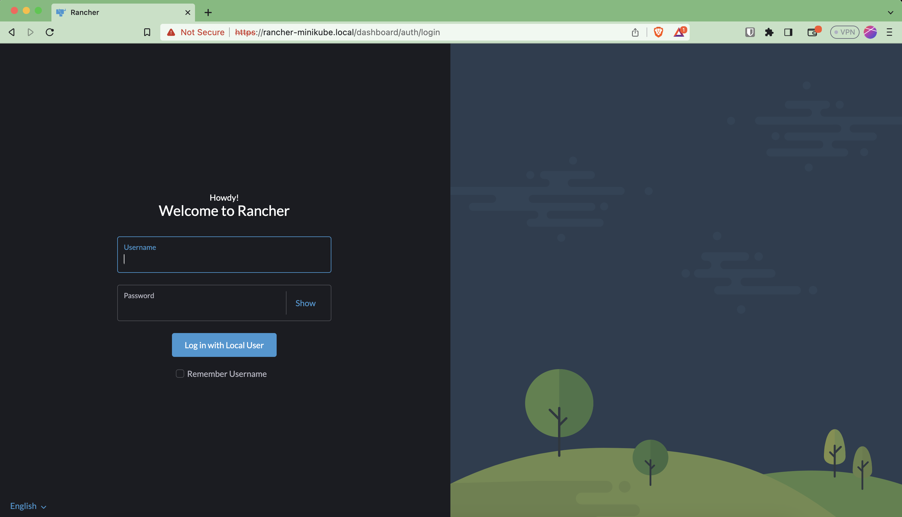
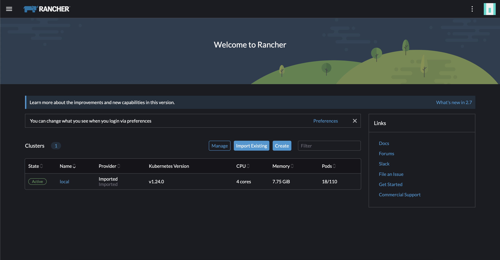

# Running control plane in minikube

## Rancher Minikube setup

Add `rancher-minikube.local` as an alias to localhost (127.0.0.1) (in `/etc/hosts`). It can be any other URL, but make sure to replace `rancher-minikube.local` with that in all the following steps.
```shell
sudo sh -c  "echo \"127.0.0.1    rancher-minikube.local\" >> /etc/hosts"
```

### Minikube setup
Install [Minikube](https://minikube.sigs.k8s.io/docs/start/)

#### Setup your Minikube Driver
Check the available minikube compatible drivers for your Operating Systems [here](https://minikube.sigs.k8s.io/docs/drivers/).

For this guide, we'll use [Colima](https://github.com/abiosoft/colima).

Remember to start Colima with a little bit additional memory, as the defaults aren't enough.
```shell
colima start --cpu 4 --memory 5 --disk 100
```

You should also start minikube with additional memory:
```shell
 minikube start --kubernetes-version=v1.24.0 --driver=docker --memory=3932 
````

```bash
 # enable ingress

 minikube addons enable ingress

 # run this in a separate terminal and keep it alive
 sudo minikube tunnel
```

Once you tunnel, leave the shell running (do not close it). It should print something like this:`
```
✅  Tunnel successfully started

📌  NOTE: Please do not close this terminal as this process must stay alive for the tunnel to be accessible ...

❗  The service/ingress rancher-minikube-release requires privileged ports to be exposed: [80 443]
🔑  sudo permission will be asked for it.
🏃  Starting tunnel for service rancher-minikube-release.

```

### Deploy Control Plane to Minikube
Inside the `minikube/` folder, run the below commands to initialize terraform and deploy the control plane to minikube.

```bash
terraform init
terraform apply --auto-approve
```


Feel free to change the defaults of the variables defined in `variables.tf` file

Open [rancher-minikube.local](http://rancher-minikube.local) in browser. You should see something like this. You don't have to worry about this, as your network traffic with the control plane and minikube will not leave your computer.



**Select Advanced > Proceed to rancher-minikube.local (unsafe)**

You should be greeted with a login UI.




Username is: `admin`. Password is what you have give in the `variables.tf` file.

You should be able to see the Rancher dashboard, which looks like below




### Troubleshooting


If you see output in any other format, such as the one below, plese note that you have a wrong networking plugin (or a wrong driver for minikube). This will result in a failed installation. Please use one of the available minikube compatible drivers for your Operating Systems from [here](https://minikube.sigs.k8s.io/docs/drivers/).


```
(This will not work!)
Status: 
        machine: minikube
        pid: 54080
        route: 10.96.0.0/12 -> 192.168.105.3
        minikube: Running
        services: []
    errors: 
                minikube: no errors
                router: no errors
                loadbalancer emulator: no errors
```


