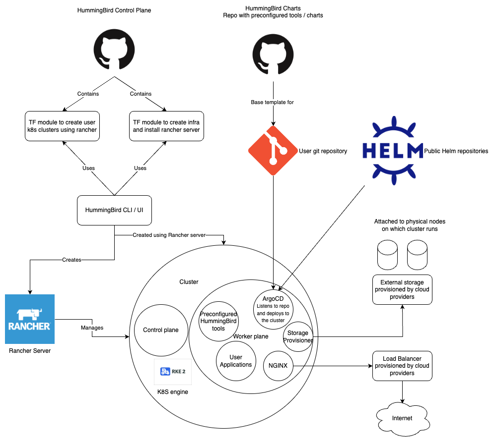
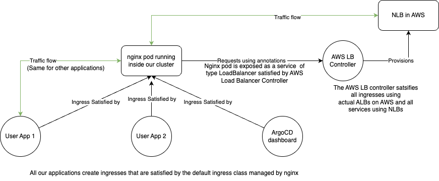

**Note:** All decisions which have been taken so far, and implemented are subject to change.

The project has four repositories as of now.

- [HummingBird Control Plane](https://github.com/sahajsoft/hummingbird-control-plane)
- [HummingBird Charts](https://github.com/sahajsoft/humming-bird-charts)
- [HummingBird CLI](https://github.com/sahajsoft/hummingbird-cli/)
- [HummingBird UI](https://github.com/sahajsoft/humming-react-ui)

The idea is that the first repository can be used for creating the control plane, while the second one can be used to deploy the services we want in the cluster. This way, both of them can change independent of each other. Even though the control plane is subject to (constant) change, as long as we can connect to `kube-api-server` on control plane, we can deploy our services into the cluster.
The CLI and UI allow users to use HummingBird to create new clusters or interact with their existing clusters.

High level diagram of how things work: 

### Deploying applications to the cluster

We use [ArgoCD](https://argo-cd.readthedocs.io/en/stable/) for managing deployments.
ArgoCD is a declarative GitOps CD tool to deploy onto a kubernetes cluster.

Most of the tools and services that HummingBird comes with are also installed onto the cluster using ArgoCD.

Adding your own applications to the cluster is as easy as providing a few parameters to one of two terraform modules -
argo-git-application or argo-helm-application based on the source of our application.
If it is a git repository with a directory containing regular k8s manifests, you should use argo-git-application and
if it is a helm chart from a helm repository, you should use argo-helm-application

Note: Currently only public helm repositories are supported  

### CI

While HummingBird can be used with external CI tools, we recommend using [Tekton Pipelines](https://tekton.dev/docs/pipelines/pipelines/). 
This allows our CI to be generic and be run on our existing cluster infrastructure preventing lock-in to any git repository service. 

Note: Tekton integration with HummingBird is still a WIP.

### Exposing applications

Applications running inside the cluster are not accessible from outside by default and have to be exposed explicitly.

An NGINX deployment is created as a part of the initial setup process using which ArgoCD and other tools are exposed.
To expose user applications outside the cluster, the same nginx deployment can be used by creating ingresses with the [default ingress class](https://kubernetes.io/docs/concepts/services-networking/ingress/#default-ingress-class).
These ingresses are satisfied by our NGINX ingress controller.

The NGINX deployment itself is exposed externally using a physical load balancer provisioned by our cloud provider.

Currently, the only cloud provider supported is AWS with the [AWS Load Balancer Controller](https://kubernetes-sigs.github.io/aws-load-balancer-controller/v2.4/).
This allows us to provision an AWS NLB to expose our nginx deployment.

